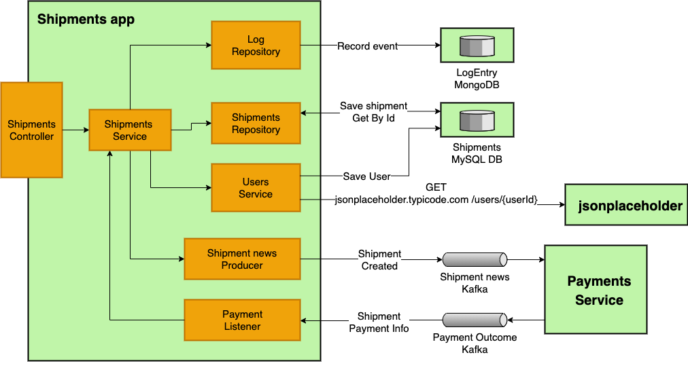

# Spring integration tests demo

This is a demo application that show cases how to do integration tests using spring boot and Cucumber for BDD/Acceptance.

Requirements:

- Java 16
- Docker
- Maven

## Features

- Receive an API call: Receive requests to create products and shipments
- Make an API call: Call [`jsonplaceholder.typicode.com`](jsonplaceholder.typicode.com) to retrieve users
- Store/Retrieve from MySql: Save products and shipments into MySql
- Store/Retrieve from MongoDB: Save a log entry when something happens.
- Send to kafka: Send news when a new shipment is created
- Receive from kafka: Listen for messages from a `payments service` that will notify if the shipment was paid.

## Components




## Notes

- Not doing unit tests as it's not the idea of this project.
- Went with H2, embedded mongo and embedded kafka instead of [Test containers](https://www.testcontainers.org/) because my idea was to show spring features.
- As an extra mile I have added custom [Assertj](https://assertj.github.io/doc/) assertions for [mongo](https://github.com/nacho270/spring-integration-tests-demo/blob/master/src/test/java/com/nacho/blog/spring/integration/tests/demo/service/MongoLogAssertion.java) 
  and [shipments](https://github.com/nacho270/spring-integration-tests-demo/blob/master/src/test/java/com/nacho/blog/spring/integration/tests/demo/service/ShipmentAssertion.java).

## Run tests from IDE

Run `cucumber.CucumberTestsRunner`.

- It will use the config from [`cucumber.config.CucumberConfig`](https://github.com/nacho270/spring-integration-tests-demo/blob/master/src/test/java/cucumber/config/CucumberConfig.java).
- It will start the application with H2, embedded mongo and embedded kafka.
- It will run tests from [`src/test/resources/cucumber/shipment.feature`](https://github.com/nacho270/spring-integration-tests-demo/blob/master/src/test/resources/cucumber/shipment.feature)

## Run application locally

- Spin up the infrastructure with `docker`:

```shell
docker compose up
```

- Wait un ready 
- Run `com.nacho.blog.spring.integration.tests.demo.Application` from the IDE.

## Usage

### Create a product

- Request:
  ```shell  
    curl -XPOST localhost:8080/product -H 'Content-type:application/json' -d '{ "name":"mac", "price":1000 }'
  ```
  
- Response: 
```json
{
  "id":"0296e191-e377-4455-b450-850e8efa2c25",
  "name":"mac",
  "price":1000
}
```

### Create a shipment

- Request:
  ```shell
  curl -XPOST localhost:8080/shipment -H 'Content-type:application/json' -d '{ "userId":1, "items":[{ "product": "0296e191-e377-4455-b450-850e8efa2c25", "quantity":1 }]  }'
  ```
- Response:
```json
{
  "id":"0d140d39-70cb-4332-b317-3f23363b05ee",
  "items":[
      {
        "id":"8a078d34-8690-444e-80ea-86b6de58f7b7",
        "product":{
          "id":"0296e191-e377-4455-b450-850e8efa2c25",
          "name":"mac",
          "price":1000.00
        },
        "quantity":1
      }
  ],
  "total":1000.00,
  "user":{
    "id":1,
    "email":"Sincere@april.biz"
  },
  "paymentStatus":"PENDING"
}
```

### Get shipment by id

- Request: 
  ```shell
  curl localhost:8080/shipment/0d140d39-70cb-4332-b317-3f23363b05ee
   ````

- Response:
```json
{
  "id":"0d140d39-70cb-4332-b317-3f23363b05ee",
  "items":[
    {
      "id":"8a078d34-8690-444e-80ea-86b6de58f7b7",
      "product":{
        "id":"0296e191-e377-4455-b450-850e8efa2c25",
        "name":"mac",
        "price":1000.00
      },
      "quantity":1
    }
  ],
  "total":1000.00,
  "user":{
    "id":1,
    "email":"Sincere@april.biz"
  },
  "paymentStatus":"PAID"
}
```

### Other operations

- Get product by id: `curl localhost:8080/product/0296e191-e377-4455-b450-850e8efa2c25`
- Shipment count: `curl localhost:8080/shipment/count`
- Delete all shipments: `curl -XDELETE localhost:8080/shipment`
- List products: `curl localhost:8080/product`


## Useful kafka commands

- To send payment notification:
    
```shell
docker exec -it kafka bash
kafka-console-producer.sh --topic payment_outcome --broker-list localhost:9092
#Wait for the prompt as it takes a few seconds to show up
{"shipmentId":"0d140d39-70cb-4332-b317-3f23363b05ee", "paymentStatus":"PAID"}
```
    
- To consume messages:
    
```shell
docker exec -it kafka bash
kafka-console-consumer.sh --topic shipment_news --bootstrap-server localhost:9092
```
